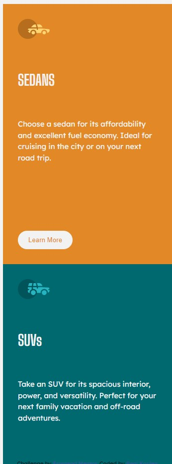

# Frontend Mentor - 3-column preview card component solution

This is a solution to the [3-column preview card component challenge on Frontend Mentor](https://www.frontendmentor.io/challenges/3column-preview-card-component-pH92eAR2-). Frontend Mentor challenges help you improve your coding skills by building realistic projects.

## Table of contents

- [Overview](#overview)
  - [The challenge](#the-challenge)
  - [Screenshot](#screenshot)
  - [Links](#links)
  - [Built with](#built-with)
  - [Useful resources](#useful-resources)
  - [Author](#author)

**Note: Delete this note and update the table of contents based on what sections you keep.**

## Overview

### The challenge

Users should be able to:

- View the optimal layout depending on their device's screen size
- See hover states for interactive elements

### Screenshot

### Links

- Solution URL: https://github.com/renikoulen/fm-3-column-preview-card-component-main.git
- Live Site URL: https://meek-biscochitos-2a3b30.netlify.app

### Built with

- Semantic HTML5 markup
- CSS custom properties
- CSS Grid

### Useful resources

- https://gwfh.mranftl.com/ - google Webfonts Helper - This helped me with making sure the way I use my fonts is GDPR conform.
- https://www.w3schools.com - W3Schools Online Web Tutorials - This is an amazing source which helped me with most of my questions regarding CSS.

## Author

- Frontend Mentor - [@reni](https://www.frontendmentor.io/profile/renikoulen)
